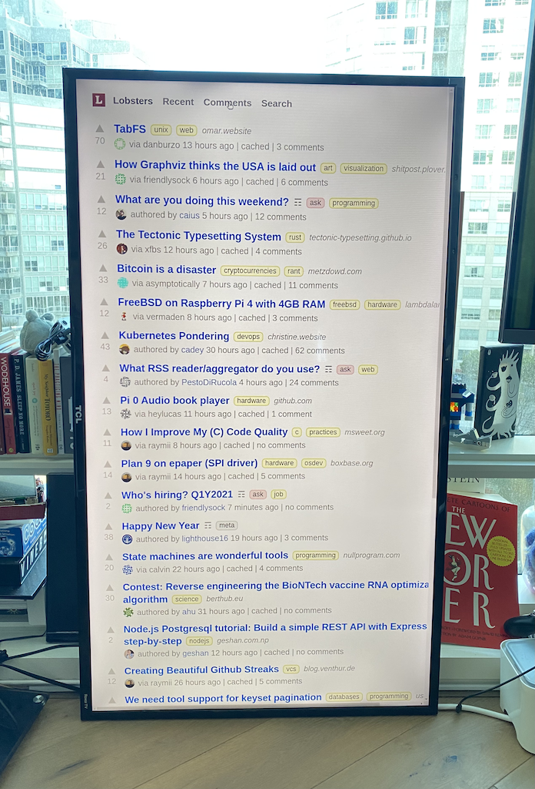
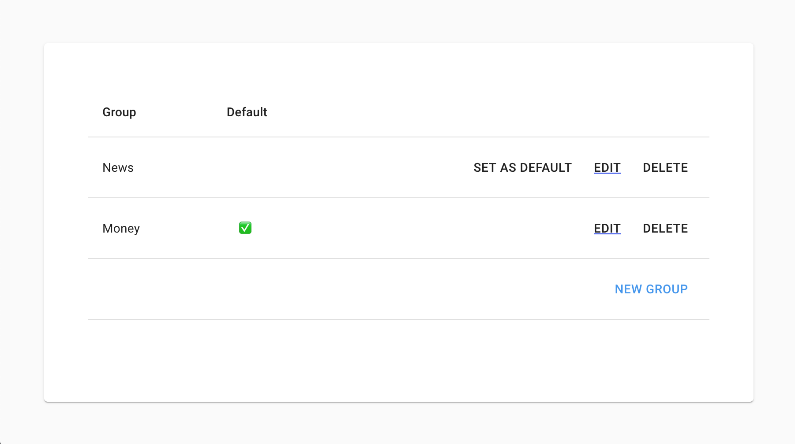
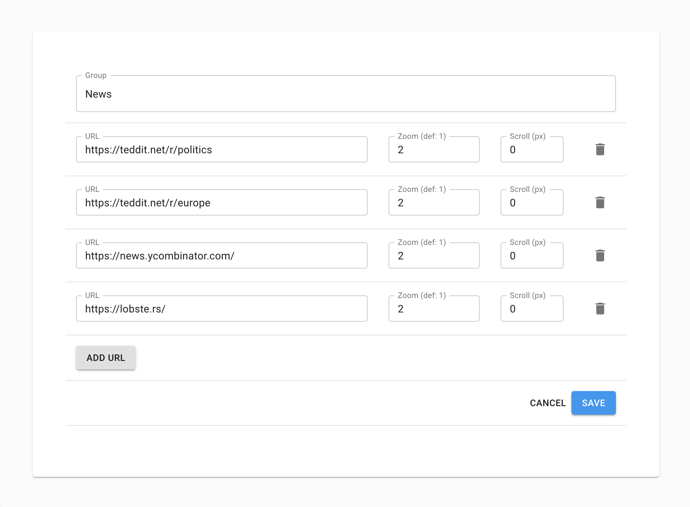

# DS @ Home

Digital Signage at Home? Data Sciene @ Home? Double Sandwich @ 🏠?

Turn your old TV / Monitor into a carousel of content.

## What it looks like



#### Stocks


#### News


#### Multiple group support



#### Specifying URLs with Zoom and Scroll settings



### Keyboard shortcuts

By default the shortcuts are Cmd/Ctrl + Shift + [Key].
Switch to [Key] only by running with `--single-touch`

| Key   | Description      |
| ----- | ---------------- |
| N     | Next group       |
| Right | Next page        |
| Left  | Previous page    |
| P     | Pause auto play  |
| R     | Resume auto play |
| H     | Turn display off |
| J     | Power on display |
| B     | Go back          |

During runtime, you may need control of your keyboards.
`Cmd/Ctrl + Shift + D` will toggle keyboard shortcuts.

## Running

### Dev

```
cp links.json.sample links.json
yarn install
yarn start
```

### on your RPi

Download and install a [release](https://github.com/razvvan/ds-at-home/releases)

Example:

```
$ wget https://github.com/razvvan/ds-at-home/releases/download/v0.2.1/ds-at-home_0.2.1_arm64.deb
$ sudo dpkg -i ./ds-at-home_0.2.1_arm64.deb

$ export DISPLAY=:0
$ ds-at-home --full-screen=true --single-touch=true
```
